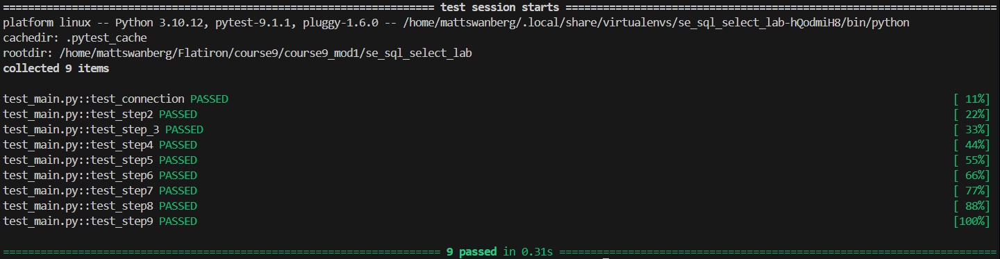

# Getting Started with Databases and SQL- Employee Records

## Overview

This project demonstrates foundational SQL querying techniques using SQLite, Python, and Pandas.

The lab focuses on retrieving and transforming data from a SQLite database using SQL `SELECT` statements. SQL queries are executed through Pandas using `pd.read_sql()`, allowing the query results to be stored and analyzed as Pandas DataFrames and Series.

## Learning Objectives

This project demonstrates how to:

- Connect Python to a SQLite database
- Execute SQL queries using Pandas
- Select specific columns from database tables
- Control the order of returned columns
- Create column aliases using `AS`
- Categorize data using `CASE`
- Manipulate strings using `LENGTH()` and `SUBSTR()`
- Perform calculations using `SUM()` and `ROUND()`
- Extract date components using `STRFTIME()`
- Store SQL query results in Pandas DataFrames and Series

## Technologies Used

- Python
- SQLite
- SQL
- Pandas
- Pytest

## Project Structure

```text
.
├── data.sqlite
├── main.py
├── test_main.py
└── README.md
```

## SQL Concepts

### Selecting Data

The project uses SQL `SELECT` statements to retrieve specific columns from tables within the SQLite database.

Examples include retrieving employee numbers, employee names, job titles, order information, and dates.

### Column Aliases

The `AS` keyword is used to assign more descriptive names to query results.

```sql
SELECT employeeNumber AS "ID"
FROM employees;
```

### CASE Statements

A SQL `CASE` expression is used to categorize employees according to their job title.

Employees with the following job titles are categorized as `Executive`:

- President
- VP Sales
- VP Marketing

All other employees are categorized as `Not Executive`.

This demonstrates how conditional logic can be incorporated directly into a SQL query.

### String Functions

The project uses SQLite string functions to transform text data.

`LENGTH()` determines the number of characters in an employee's last name.

```sql
LENGTH(lastName)
```

`SUBSTR()` extracts the first two characters from an employee's job title.

```sql
SUBSTR(jobTitle, 1, 2)
```

### Aggregate Calculations

Order totals are calculated using the price of each item and the quantity ordered.

```text
Order Total = priceEach × quantityOrdered
```

Each calculated order total is rounded using `ROUND()`, and `SUM()` is used to calculate the combined total across all orders.

This demonstrates how SQL aggregate functions can be combined with mathematical expressions.

### Date Formatting

SQLite's `STRFTIME()` function is used to extract individual components from an order date.

The project extracts:

- Day using `%d`
- Month using `%m`
- Year using `%Y`

The original order date is retained alongside the newly generated `day`, `month`, and `year` columns.

## Using SQL with Pandas

SQL queries are executed using Pandas:

```python
pd.read_sql(query, conn)
```

This allows SQL query results to be loaded directly into a Pandas DataFrame.

For queries where a single result column is required, the desired column can also be selected from the returned DataFrame to create a Pandas Series.

## Running the Project

Run the main Python file with:

```bash
python main.py
```

The results of each SQL query will be displayed in the terminal.

## Running the Tests

Run the test suite using:

```bash
pytest
```

For more detailed test output, use:

```bash
pytest -x
```

The `-x` option stops the test suite after the first failure, making it easier to debug each issue individually.

## Key Takeaways

Through this project, I practiced combining Python and SQL to retrieve and manipulate relational data.

The project reinforced several important SQL concepts, including:

- Selecting and organizing database columns
- Creating aliases
- Applying conditional logic
- Manipulating strings
- Performing aggregate calculations
- Formatting and extracting date information
- Loading SQL results into Pandas

These techniques provide a foundation for querying and analyzing relational databases from Python.

## Screenshot

### Passing testing Suite


## Author

Created by Matthew Swanberg as part of Course 9 Module 1 (Getting Started with Databases and SQL)